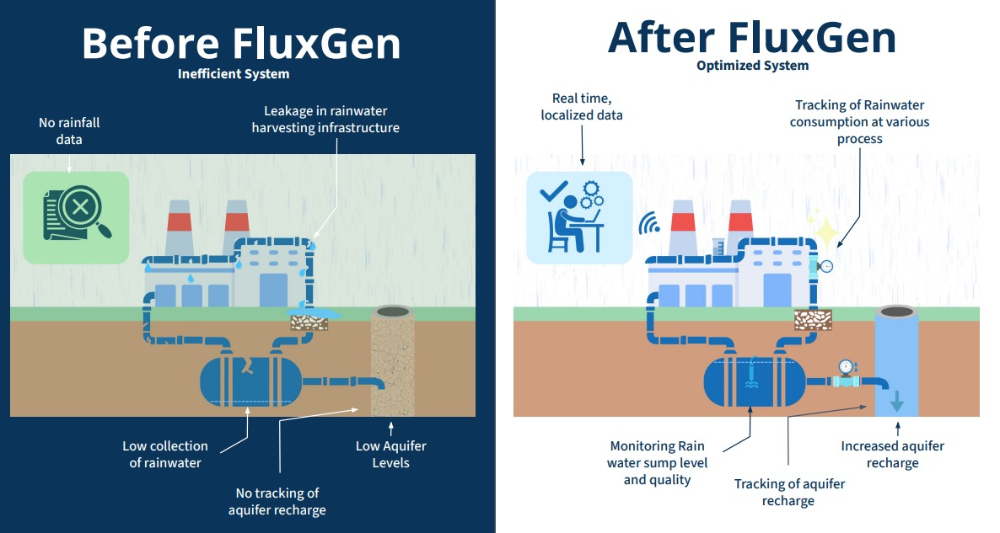

# Project Title

# Product Management & Data-Driven Solutions for Industrial Water Conservation

## Project Description

This project represents the work I completed during my Product Management internship at FluxGen, where I contributed to the analysis, design, and development of product features for an industrial water-intelligence platform. The focus of the project was on understanding real IoT environments, analysing water-flow data from industrial sites, and defining product workflows that help organisations monitor and reduce water consumption.

My work spanned across client engagement, requirement gathering, data interpretation, and product feature design. This included preparing PRDs, writing user stories, and creating wireframes for new dashboard components. I conducted a detailed, block-wise water-use analysis, identified inefficiencies, and helped define KPIs and usage thresholds for client dashboards.

On the technical side, I designed core logic structures such as offline data buffering, cloud-sync behaviour, and leakage detection rules using state-machine flows and pseudo-code. I also performed a detailed comparison of industrial flowmeters based on accuracy, stability, installation constraints, and real-world behaviour. Additionally, I explored remote sensing and catchment-level intelligence as part of strategic product research.

This repository includes the major project report, end-term presentation, demonstration video, and visual diagrams summarising various feature workflows and analyses.

## Folder Structure

```
IG21/
│
├── README.md
├── Report/
│   └── IG21.pdf
├── Presentation/
│   └── IG21.pptx
├── Diagrams/
│   ├── system_architecture.jpeg
│   ├── offline_sync_flow.jpeg
│   └── leakage_detection_logic.jpeg
├── Result/
│   ├── before_after.jpeg
└── Video/
    └── MP_DEMO.mp4
```

## Results

### _1. Improved Data Reliability — Before & After_



This illustrates how the designed offline buffering and sync logic eliminated missing data intervals and ensured continuous, ordered, and reliable data availability.

## Video Demonstration

The repository includes a 5-minute demonstration video summarising the project, covering:

- Problem overview
- Feature workflows
- Implementation
- Key contributions and outcomes

You can find it here:
[Click to View Video](Video/MP_DEMO.mp4)

## Included Files

- Major Project Report (PDF)
- End-Term Presentation (PPTX)
- Before/After Result Visualization
- System & Logic Diagrams (PNG)
- 5-Minute Demonstration Video
